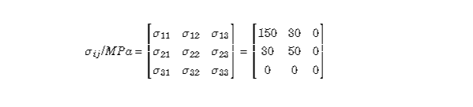
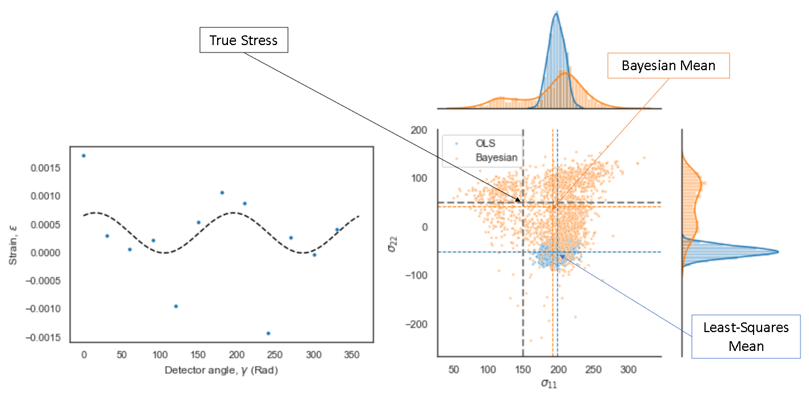
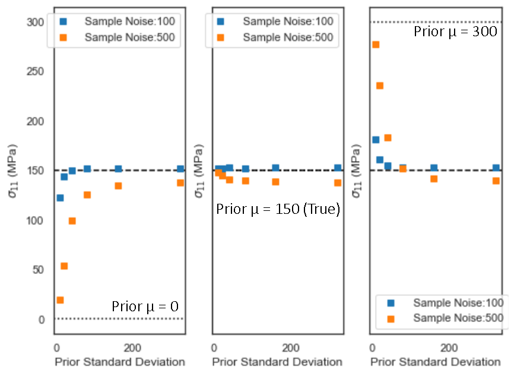

# Bayesian Regression for Stress Analyis
__What is the purpose of this project?__
Essentially what this algorithm does is you have `x = a + b`. 
1. Mutate `a` and `b` to `a'` and `b'`, adding statistical noise derived from a student's T distribution. This generates a set of 'measurements' with *non Normally-distrubuted* errors. 

NOTE: Least-Squares regression assumes errors are Normally distributed, which is why this is an important distinction because in practice strain measurements have additive error distributions. 

2. Calculate `x` from `a' + b'` using bayesian (pymc3) machine learning inference, and compare this to the value generated by Least-Squares regression, the industry standard.
3. Except `x'` is actually strain, and `a + b +...` is actually `P11S11 + P22S22` where `Sii` is a diagonal stress tensor compoent and `Pii` is a coefficint, calculated from the material's isotropic properties.

Test Stress Tensor:

## Iteration 1 (Current)
1. pymc3 used to infer stress tensor components `s11` and `s22` the result is superior to Least-Squares regression in samples with additive error distribution in the following ways 
    a) it is better at recognising uncertainty (LS can be very certain of inaccurate results)
    b) stress tensor estimate is consistently more accurate

2. Calibration Experiment successfully carried out to determine appropriate prior stength.

3. Outlier detection was carried out successfully, but yielded a minor improvement to the bayesian fit for the samples tested. 

## Iteration 2 (In Progress)
- Look into TensorFlow instead of pymc3 for ML
- calculate all 6 stress tensor components, not just diagonal.
- Clean up file structure and code to remove unnecessary dependencies and make the program more efficient.

## Iteration 3 
- Use Python Flask to create a simple interface
## Iteration 4
- Full deployment on AWS
- CI/CD using Jenkins